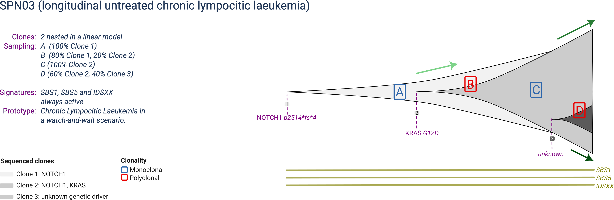
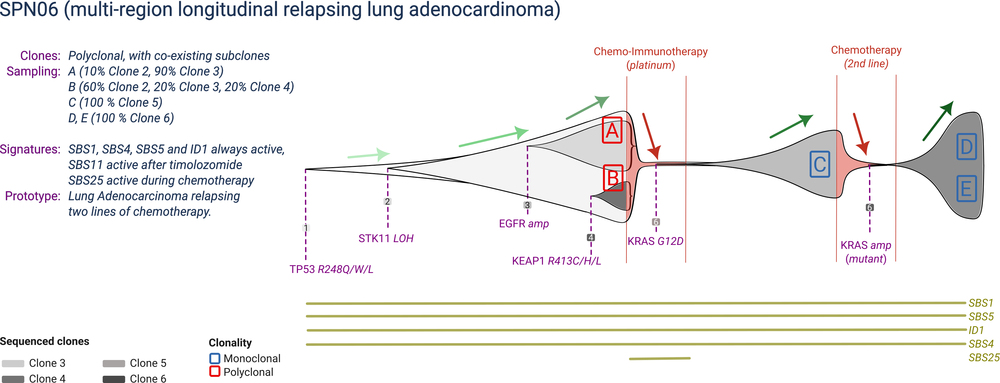
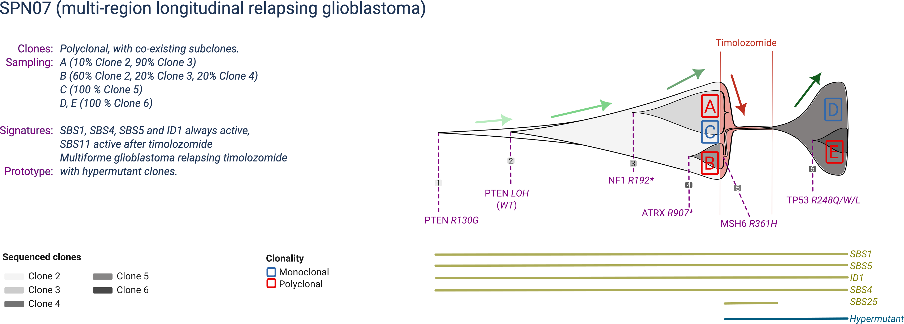

```{r, include = FALSE}
knitr::opts_chunk$set(
  collapse = TRUE,
  comment = "#>"
)
```

```{r setup}
library(rRACES)
```

The Simulated Cohort of Universal Tumours (SCOUT) is a cohort generated with rRACES, containing prototypical tumours with matched sequencing data. As in other fields of Machine Learning, the intent of SCOUT is to become a standard to benchmark algorithms for:

-   mutation calling;
-   copy number alteration calling;
-   mutational signatures deconvolution;
-   tumour subclonal deconvolution.

The main features of SCOUT are:

-   a cohort that contains realistic tumours inspired from adenocarcinomas (colorectal and lung), leukemias (chronic lymphocitic and acute myeloid), breast cancer and glioblastoma;
-   for each simulated tumour, both multi-region and/or longitudinal data, with different configurations of sample purity and sequencing coverage;
-   for some tumours, the simulated effect of treatment following typical patterns for each tumour type, including resistance caused by pre-existing or de novo tumour clones;
-   data available in the format of simulated read counts format, or as raw seqeuncing reads (FASTq) to be streamlined in any bioinformatic pipeline, with raw data in the format of whole-genome or whole-exome sequencing.

With a total of 30 TB of data, SCOUT samples can be used to benchmark pretty much most standard computational methods commonly used in the cancer genomics field.


# Summary statistics

Once the cohort is generated, we could report total number of mutations, CNas, clones etc etc.

# Simulated tumours


+----------+-----------+----------------------+-------------------------------------------------------------------------------------------------------------------------------------------------------------------------------------------------------------+
| Tumour   | Type      | Samples (timepoints) | Synopsis                                                                                                                                                                                                    |
|          |           |                      |                                                                                                                                                                                                             |
|          | (clones)  |                      |                                                                                                                                                                                                             |
+==========+===========+======================+=============================================================================================================================================================================================================+
| [SPN01]  | P (n=4)   | b=3 (t=1)            | Micro-satellite stable (MSS) colorectal cancer composed of a single clonal population, sampled at a single time-point with two multi-region biopsies.                                                       |
+----------+-----------+----------------------+-------------------------------------------------------------------------------------------------------------------------------------------------------------------------------------------------------------+
| [SPN02]  | P (n=3)   | b=2 (t=1)            | Micro-satellite instable (MSI) colorectal cancer composed of a main clonal population, sampled at a single time-point with two multi-region biopsies.                                                       |
+----------+-----------+----------------------+-------------------------------------------------------------------------------------------------------------------------------------------------------------------------------------------------------------+
| [SPN03]  | P (n=3)   | b=4 (t=4)            | Chronic lympocitic laeukemia in a watch-and-wait (i.e., untreated) scenario, with multiple subclones sampled longitudinally over four time-points.                                                          |
+----------+-----------+----------------------+-------------------------------------------------------------------------------------------------------------------------------------------------------------------------------------------------------------+
| [SPN04]  | P/R (n=3) | b=2 (t=2)            | Acute myeloyd laeukemia with a dominant clone, relapsing platinum-based chemotherapy with, sampled longitudinally before treatment and at relapse.                                                          |
+----------+-----------+----------------------+-------------------------------------------------------------------------------------------------------------------------------------------------------------------------------------------------------------+
| [SPN05]  | P (n=5)   | b=3 (t=1)            | Mismatch deficient breast cancer, with many subclones, sampled at one time-point with with three multi-region biopsies.                                                                                     |
+----------+-----------+----------------------+-------------------------------------------------------------------------------------------------------------------------------------------------------------------------------------------------------------+
| [SPN06]  | P/R (n=6) | b=5 (t=3)            | Smoking-associated lung adenocardinoma with many subclones, treated with two lines of chemotherapy, both time relapsing with a de-novo clone, sampled at three time-points with five multi-region biopsies. |
+----------+-----------+----------------------+-------------------------------------------------------------------------------------------------------------------------------------------------------------------------------------------------------------+
| [SPN07]  | P/R (n=6) | b=5 (t=2)            | Glioblastoma with many subclones, treated with a line of chemotherapy, relapsing with a hypermutant clone, sampled at three time-points with five multi-region biopsies.                                    |
+----------+-----------+----------------------+-------------------------------------------------------------------------------------------------------------------------------------------------------------------------------------------------------------+

**Legend:** Primary (P), Relapse (R), Number of simulated clones (n), Number of sampled time-points (t), Total number of biopsies (b).

## SPN01

<br>

SPN01 is a prototype micro-satellite stable (MSS) colorectal cancer composed of 4 clones, with one dominant clone at sampling. The dominant clone harbours a full inactivation of the APC gene by point mutation and concurrent loss of heterozygosity (LOH) of the wildtype allele, together with two activating mutations in the KRAS and PIK3CA oncogenes.

SPN01 is profiled by multi-region with 3 samples collected at the same time-point.

## SPN02

<br>

SPN02 is a prototype micro-satellite instable (MSI) colorectal cancer composed of 3 clones, with one dominant clone at sampling. The dominant clone harbours a mutant BRAF, PIK3CA and MSH6. The MSH6 mutation makes the tumour hypermutant, enabling a specific mutational signature.

SPN02 is profiled by multi-region with 2 samples collected at the same time-point.

## SPN03

<br>

SPN03 is a prototype chronic lymphocitic leukemia composed of 3 clones, with eventually one largely dominant but one still expanding. The largest clone harbours activating mutations in NOTCH1 and KRAS, and the last expanding subclone is not linked to any specific genetic mutation or copy number driver event.

SPN03 is profiled in a watch-and-wait scenario (an active survaillance scenario in which the patient is observed untill white blood counts exceed a predefined threshould), acquiring one sample at each of 4 time-points, with distinct clonal compositions reflecting the ongoing dynamics.

## SPN04

<br>

SPN02 is a prototype acute myeloyd leukemia composed of 3 clones, with one becoming dominant at every sampling. The dominant clone harbours a mutant IDH1, a copy number gain of KRAS and a mutant NRAS.

SPN01 is profiled before and after platinum-based chemotherapy, relapsing with the same clone presented before treatment. Chemotherapy generates a mutational signature specific during its exposure.

## SPN05

<br>

SPN05 is a prototype mismatch-repair deficient breast cancer composed of 5 clones, with three detectable at sampling. The ancestral clone harbours a mutant TP53, and a full BRCA2 inactivation by joint mutation and LOH (also linked to a specific mutational signature). The two expanding subclones are both associated with copy numbers: one has ongoing TP53 LOH, the other CDKN2A LOH.

SPN05 is profiled at a single time-point with three biopsies, reflecting the distinct tumour composition in terms of clones distribution.

## SPN06

<br>

SPN06 is a prototype smoking-associated lung adenocarcinoma, with 6 clones that compete over time during two lines of treatment. The main clonal population is driven by mutant TP53 and STK11, but manifests two subclones: one associated with an EGFR amplification, and one by a KEAP1 mutation. Upon chemo-immunotherapy (which leaves a mutational signature), a KRAS-driven subclone drives relapse, whereas the two other subclones are eradicated by treatment. Upon a second line of chemotherapy (which does not leave a mutational signature), resistance is driven by an aquired amplification of the mutant KRAS allele.

SPN06 is profiled at a three time-points, before treatment and at relapse of each treatment. The two diagnostic biopsies are polyclonal, whereas relapse biopsies are monoclonal.

## SPN07

<br>

SPN06 is a prototype glioblastoma with 6 clones that compete over time during a single line of treatment. The main clonal population is driven by inactivated PTEN (mutation and LOH), but manifests two subclones: one associated with an ATRX1  mutation, and one by a NF1 mutation. Upon chemotherapy by timolozomide (which causes an MSH6 mutation and microsatellite instability), resistance is achieved by a hypermutant subclone. Within the relapse clone, an extra subclone emerges due to a TP53 mutation.

SPN07 is profiled at a two time-points, before treatment and at relapse of each treatment. The three diagnostic and two relapse biopsies are polyclonal.
